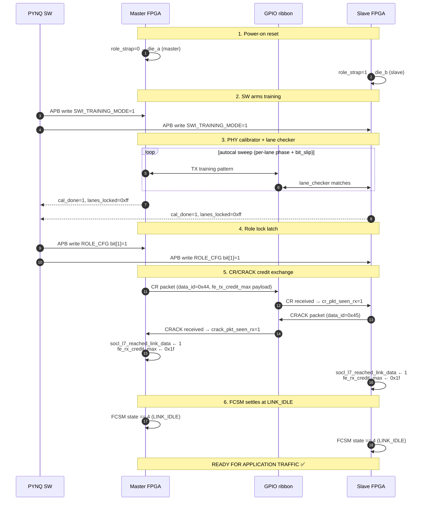
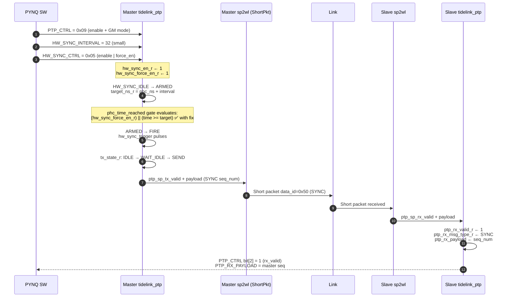
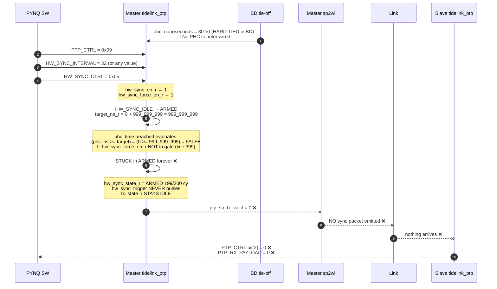

# TideLink bug visualisation — expected vs current flows

Two diagrams: (A) what *should* happen end-to-end, and (B) what *actually* happens on Build #9 silicon. Bug positions called out with 🐛.

---

## DIAGRAM 1 — Bringup sequence

### A. Expected bringup (works today on Build #9)



**Current Build #9 silicon: this whole sequence works** (16/16 link, both cal_done=1, both FCSM=4).

### B. Where it deviates (not Bug A's territory)

Nothing — bringup is healthy. All bugs manifest in the next stage (data transfer).

---

## DIAGRAM 2 — AHB packet M→S data transfer

### A. EXPECTED data flow (what should happen)

```
┌──────────────────────────────── MASTER FPGA ─────────────────────────────────┐
│                                                                              │
│   PYNQ kernel mmap()                                                         │
│         │ writes /dev/mem at 0x44000000 (AHB_TX aperture)                    │
│         ▼                                                                    │
│   ┌──────────────┐    AXI BVALID    ┌──────────────────┐                     │
│   │ PS7 M_AXI_GP0│────────────────► │ AXI SmartConnect │                     │
│   └──────────────┘ ◄────HREADY───── │  (1 master, 6    │                     │
│                                     │   AHB slaves)    │                     │
│                                     └────────┬─────────┘                     │
│                                              │                               │
│                                              ▼                               │
│                                     ┌──────────────────┐                     │
│                                     │ axi_ahb_tx bridge│                     │
│                                     └────────┬─────────┘                     │
│                                              │ AHB-Lite                      │
│                                              ▼                               │
│   ┌────────────────────────────────────────────────────────────┐             │
│   │ tidelink_fc_adapter (TX aperture)                          │             │
│   │   • tx_valid_addr_phase = HSEL & HWRITE & HREADY           │             │
│   │   • tx_data_phase_r latches next cycle                     │             │
│   │   • tx_fc_word = {PKT_FIFO_DATA, addr, data}  ← 00,addr,data│            │
│   │   • arbiter grant (FIFO_DATA over sideband when not busy)  │             │
│   │   • skid_valid_r ← arb_data on (arb_valid & skid_can_accept)│            │
│   │   • tl_fc_a2l_valid = skid_valid_r        ◄── output       │             │
│   └────────────────────────────┬───────────────────────────────┘             │
│                                │ tl_fc_a2l_valid + tl_fc_a2l_data[47:0]      │
│                                ▼                                             │
│   ┌────────────────────────────────────────────────────────────┐             │
│   │ Wlink (chiplet controller) — master side                   │             │
│   │   a2l_fc_replay (CDC hclk→link_clk)                        │             │
│   │     ↓ a2l_full check (must be 0)                           │             │
│   │     ↓ a2l_fc_replay_app_valid → FIFO write                 │             │
│   │     ↓ a2l_fc_replay_link_valid → TX framer                 │             │
│   │   FC packet: { ECC, data_id=0xa1, payload[47:0], pktnum }  │             │
│   │   ↓                                                        │             │
│   │   WavD2DGpioTx byte serdes → 8 lanes + clk                 │             │
│   └────────────────────────────┬───────────────────────────────┘             │
└────────────────────────────────┼─────────────────────────────────────────────┘
                                 │ 8-lane GPIO ribbon + pad_clk
                                 ▼
┌──────────────────────────────── SLAVE FPGA ──────────────────────────────────┐
│   ┌────────────────────────────────────────────────────────────┐             │
│   │ Wlink — slave side                                         │             │
│   │   WavD2DGpioRx deser → byte_align → lane_checker valid     │             │
│   │   ↓ llrx packet assembly (ECC check, pkt_is_data_pkt=1)    │             │
│   │   ↓ ack_nack_fifo write (kind=000=expected for data_id=0xa1)│            │
│   │   ↓ ack_nack_fifo read → isExpPacket=1                      │             │
│   │   ↓ l2a_fc_replay write (CDC link_clk→hclk)                │             │
│   │   ↓ l2a_fc_replay_app_valid asserts                        │             │
│   │   tl_fc_l2a_valid + tl_fc_l2a_data[47:0]      ◄── output   │             │
│   └────────────────────────────┬───────────────────────────────┘             │
│                                │                                             │
│                                ▼                                             │
│   ┌────────────────────────────────────────────────────────────┐             │
│   │ tidelink_fc_adapter (RX FSM)                               │             │
│   │   • rx_pkt_type = data[47:46]                              │             │
│   │   • IF 2'b00 (FIFO_DATA): fc_rx_fifo_valid → RX FIFO write │             │
│   │     fc_rx_fifo_addr = data[45:32]                          │             │
│   │     fc_rx_fifo_wdata = data[31:0]                          │             │
│   │   • IF 2'b01 (SIDEBAND): fc_rx_cfg_psel → APB write        │             │
│   └────────────────────────────┬───────────────────────────────┘             │
│                                │                                             │
│                                ▼                                             │
│   ┌────────────────────────────────────────────────────────────┐             │
│   │ tidelink_fifo (RX FIFO @ 0x44010000)                       │             │
│   │   • RAM[fc_rx_fifo_addr] ← fc_rx_fifo_wdata                │             │
│   │   • REG_PKT_LEN (0x44032008) increments on packet boundary │             │
│   │   • packet_committed → released_credits queued for returner│             │
│   └────────────────────────────────────────────────────────────┘             │
│                                                                              │
│   SW reads slave APB:                                                        │
│   • REG_PKT_LEN > 0     ✅                                                   │
│   • RX_FIFO[0..N] = master payload     ✅                                    │
└──────────────────────────────────────────────────────────────────────────────┘
```

### B. CURRENT (Build #9 silicon) — where it ACTUALLY breaks

```
┌──────────────────────────────── MASTER FPGA ─────────────────────────────────┐
│   PYNQ kernel mmap() → /dev/mem at 0x44000000                                │
│   ┌──────────────┐                  ┌──────────────────┐                     │
│   │ PS7 M_AXI_GP0│ ─── AXI write ─► │ AXI SmartConnect │  ✅                 │
│   └──────────────┘ ◄── BVALID ───── │                  │                     │
│                                     └────────┬─────────┘                     │
│                                              ▼                               │
│                                     ┌──────────────────┐                     │
│                                     │ axi_ahb_tx bridge│  ✅                 │
│                                     └────────┬─────────┘                     │
│                                              ▼                               │
│   ┌────────────────────────────────────────────────────────────┐             │
│   │ tidelink_fc_adapter (TX aperture)                          │             │
│   │   tx_valid_addr_phase fires ✅                              │             │
│   │   tx_data_phase_r latches ✅                                │             │
│   │   ◄══════════ L11 WATCHDOG (Build #8 fix) ═══════════►     │             │
│   │   IF HREADYOUT stuck low 16 cy → force HREADY=1 4 cy,      │             │
│   │   drop word, bump tx_dropped_cnt_r ← prevents PS hang ✅   │             │
│   │   skid_valid_r — fires in F1 force experiment but          │             │
│   │   in normal AHB write...                                   │             │
│   │                                                            │             │
│   │   tl_fc_a2l_valid output  ── ❓ does it actually fire?     │             │
│   │   (Candidate #1 of the open Bug A correctness)              │             │
│   └────────────────────────────┬───────────────────────────────┘             │
│                                ▼                                             │
│   ┌────────────────────────────────────────────────────────────┐             │
│   │ Wlink — master side                                        │             │
│   │   a2l_fc_replay CDC                                        │             │
│   │   ┌─ 🐛 if a2l_full asserts AND L11 hasn't fired yet:      │             │
│   │   │     wedge primitive — was hard wedge, now mitigated   │             │
│   │   │                                                       │             │
│   │   │  a2l_fc_replay_app_valid — ❓ does master TX really emit? │         │
│   │   │  fe_tx_credit_max — populated from CRACK (0x1f) ✅     │             │
│   │   │  pkt_is_cr_pkt / pkt_is_crack_pkt — both seen 1 ✅    │             │
│   │   └─ TX framer                                             │             │
│   │      WavD2DGpioTx serdes → 8 GPIO lanes                   │             │
│   └────────────────────────────┬───────────────────────────────┘             │
└────────────────────────────────┼─────────────────────────────────────────────┘
                                 │ 8-lane GPIO ribbon
                                 │ ❓ Candidate #2: are bits [47:46] flipped on wire?
                                 │ (sim cannot reproduce; HW open)
                                 ▼
┌──────────────────────────────── SLAVE FPGA ──────────────────────────────────┐
│   ┌────────────────────────────────────────────────────────────┐             │
│   │ Wlink — slave side                                         │             │
│   │   llrx packet assembly — ECC + decode                      │             │
│   │   pkt_is_data_pkt fires 26 cy/500 ✅ (sim today)            │             │
│   │   ack_nack_fifo kind=000 (expected)                        │             │
│   │   isExpPacket fires 25 cy ✅ — decode classifies correctly │             │
│   │   crcCorruptSeen = 0 ✅ — no CRC errors                    │             │
│   │   isNotExpPacket_l7 = 0 ✅ — no seq mismatch               │             │
│   │   send_nack_req NEVER LATCHES ✅ — Q5 NACK theory FALSE    │             │
│   │                                                            │             │
│   │   ❓ But does l2a_fc_replay_app_valid actually fire?        │             │
│   │   (Candidate #3 of open Bug A correctness)                  │             │
│   │   tl_fc_l2a_valid output ── ❓ does it fire?               │             │
│   └────────────────────────────┬───────────────────────────────┘             │
│                                ▼                                             │
│   ┌────────────────────────────────────────────────────────────┐             │
│   │ tidelink_fc_adapter (RX FSM)                               │             │
│   │   rx_pkt_type = data[47:46]                                │             │
│   │   ❓ Candidate #4: does master's PKT_FIFO_DATA (00) become │             │
│   │      PKT_SIDEBAND (01) here? — would route to APB cfg       │             │
│   │      instead of FIFO. Unit test 10/10 PASS for the exact   │             │
│   │      word — falsified at the input — but could a Wlink-   │             │
│   │      delivery race corrupt it? Open until probed in sim.   │             │
│   └────────────────────────────┬───────────────────────────────┘             │
│                                ▼                                             │
│   ┌────────────────────────────────────────────────────────────┐             │
│   │ tidelink_fifo (RX FIFO @ 0x44010000)                       │             │
│   │   ❌ REG_PKT_LEN stays 0                                    │             │
│   │   ❌ RX_FIFO[0..N] stays all zeros                          │             │
│   │   ❌ slave never sees the AHB packet payload                │             │
│   └────────────────────────────────────────────────────────────┘             │
│                                                                              │
│   SW reads slave APB:                                                        │
│   • REG_PKT_LEN = 0     ❌ ← THE OBSERVABLE BUG                              │
│   • RX_FIFO[0..N] = 0   ❌                                                   │
└──────────────────────────────────────────────────────────────────────────────┘
```

**Bug A correctness lives at one of the 4 ❓ marks.** Today's delivery-path sim agent (running) will resolve which.

**Bug A wedge primitive (PS bus deadlock)** — mitigated by L11 watchdog ✅ — no longer requires manual power-cycle.

---

## DIAGRAM 3 — PTP HW_SYNC (Bug B)

### A. Expected (with Bug B fix applied)



### B. CURRENT (Build #9, Bug B fix reverted) — where it BREAKS



**Two compounding faults**:
1. 🐛 RTL: `phc_time_reached` at [tidelink_ptp.sv:399](../src/rtl/tidelink_ptp.sv#L399) doesn't bypass on `hw_sync_force_en_r` (the other 2 HW_SYNC gates DO bypass)
2. 🐛 BD: `phc_nanoseconds` tied to `30'h0` ([pynq-z2-pair-flip-ila/tidelink_design.tcl Q4 note](../fpga/targets/pynq-z2-pair-flip-ila/tidelink_design.tcl)) — no free-running counter wired

**1-line RTL fix is sim-validated** (`docs/BUG_B_FIX_VERIFICATION_2026_05_29.md`, 3/3 tests PASS) but reverted from working tree intentionally. Applying it unblocks the `force_en` path immediately. BD-level PHC counter is a separate workstream for the non-force_en time-based path.

---

## Quick reference — failure-state observability

What you can read via APB from PYNQ SW today to diagnose:

| APB read | Meaning | Healthy value | Bug-A current value | Bug-B current value |
|---|---|---|---|---|
| `SWI_LANE_STATUS` (0x108) | lane lock + cal_done | 0x018900ff (locked + cal) | 0x018900ff ✅ | 0x018900ff ✅ |
| `REG_STATUS` (0x010) | returner busy, fifo_underrun | 0x00 | 0x04 (underrun) after L11 drop | 0x00 |
| `CRED` (0x00c) | local free credits | 0x1000 | 0x1002 ✅ (slight movement) | 0x1000 |
| `REG_PKT_LEN` (0x008) | RX FIFO packet length | >0 after master AHB | **0 ❌** | n/a |
| `REG_DOORBELL_RESP_ACC` (0x024) | Doorbell counter | 0x1000 (after ~100 rings) | 0x1000 ✅ | n/a |
| `PTP_CTRL` (0x034) bit[2] | `ptp_rx_valid_r` | 1 after master HW_SYNC | n/a | **0 ❌** |
| `HW_SYNC_STATUS` (0x048) | active/busy/seq/phc_locked | 0x00040001 + seq | n/a | 0x00000001 (only enable bit, no FIRE) |

---

## Where to look once delivery-path sim agent returns

When `docs/BUG_A_DELIVERY_PATH_SIM_2026_06_01.md` lands, it'll answer ONE of these:

```
┌──────────────────────────────────────────────────────────────────┐
│   if master tl_fc_a2l_valid never fires:                         │
│      → Bug is master TX-side (a2l_fc_replay / fe_tx_credit_max)  │
│      → Look at Candidate #1 in Diagram 2B                        │
│                                                                  │
│   if slave tl_fc_l2a_valid never fires:                          │
│      → Bug is in Wlink TX→RX path                                │
│      → Look at Candidate #2 (wire integrity) — HW-only           │
│      → OR Candidate #3 (l2a_fc_replay_app_valid gate)             │
│                                                                  │
│   if slave tl_fc_l2a_valid fires with pkt_type=01 (SIDEBAND):    │
│      → Bug is bit-position corruption                             │
│      → Look at WavD2DGpioTx/Rx byte ordering                     │
│                                                                  │
│   if slave tl_fc_l2a_valid fires with pkt_type=00 (FIFO_DATA)    │
│      but fc_rx_fifo_valid never asserts:                         │
│      → Bug is in slave fc_adapter RX FSM                         │
│      → Look at Candidate #4 (rx_state_r logic)                    │
└──────────────────────────────────────────────────────────────────┘
```

Each candidate has a ≤10-line RTL fix once located. The wedge primitive is gone, so this iteration loop is fast.
