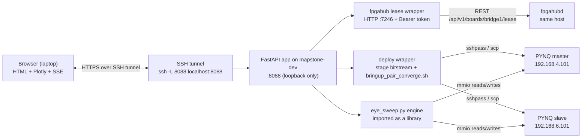

# Live Eye Browser Toolkit — Implementation Proposal

**Status:** DESIGN — awaiting user assessment, no code written
**Date:** 2026-05-27

## 1. Goal

Collapse the current 4-step manual ritual (lease bridge1 → stage bitstream → SSH-deploy+converge → SSH-run `eye_sweep.py`) into "open a URL, click Run, watch the eye render live in the browser." Reuse the existing v1 16-phase global sweep in `pynq_host/scripts/eye_toolkit/eye_sweep.py`; design the system so the future v2 "deep mode" (per-lane 128-point score grid via Region-10 APB) drops in behind the same UI shell.

## 2. Architecture



**Components:**

- **Browser (user's laptop)** — single HTML page, vanilla JS + Plotly.js (CDN). No build step.
- **Web server (`tideeye_web`, FastAPI + uvicorn)** runs on `mapstone-dev`, bound to `127.0.0.1:8088`. mapstone-dev is the only host with routes to the PYNQ /24 subnets *and* fpgahubd's REST socket.
- **Lease wrapper** — thin Python module that talks to fpgahubd REST (`/api/v1/boards/bridge1/lease`) using the local unix socket or a Bearer token. Handles acquire / heartbeat / release / wait-until-granted.
- **Deploy wrapper** — Python module that locates a staged `tidelink.bin{,.manifest.json}` pair, invokes `deploy_pair.sh` for die_a + die_b in parallel, then drives the existing converge loop.
- **Sweep engine** — import `eye_sweep.sweep_global_phase()` directly; do *not* shell out. Stream per-phase results as soon as each `remote_read(SWI_LANE_STATUS_ADDR)` returns.
- **Result transport** — Server-Sent Events (SSE) push per-phase rows + state-change events to the browser.

## 3. What "live" means — UX default

**Default UX (v1):** "**Continuous re-sweep with 16-row scrolling matrix.**" The page shows a 16-row × 8-lane heatmap that gets one row updated every `PHASE_SETTLE_S` (~0.5s); a full sweep completes every ~8s, then the loop restarts. Each cell shows the most recent lock bit at that (phase, lane). A small "frame age" tag on each row tells the user how stale that phase is. The user sees the eye drift over time, not just one snapshot.

**Justification:** The sweep itself is the bottleneck (8s × 2 boards = 16s if serial, 8s if parallel). Anything faster requires v2-deep RTL. "Continuous" pays the same per-row cost as "snapshot," but feels alive and surfaces drift/marginality the user otherwise misses.

**Feature flags (v1.x):**
- `mode=single` — fire one sweep on demand, freeze the heatmap, stop.
- `mode=averaging` — accumulate `lock_count` over N sweeps, display a heatmap of per-cell pass-rate. Catches marginal phases.
- `mode=deep` (v2, gated on Region-10 RTL) — full 8 × 128 per-lane grid using the score buffer.

## 4. Rendering choice

| Option | Pros | Cons | Verdict |
|---|---|---|---|
| Server-renders PNG, browser polls every Ns | Reuse existing `render_png()`. Zero JS. | Flicker on refresh; can't show per-phase progress | Reject for default; keep as `/snapshot.png` endpoint |
| Server streams JSON over SSE, browser renders Plotly heatmap | Live per-phase updates. Plotly handles 16×8 trivially. No heavy frontend deps. | Need a frontend (vanilla JS, ~150 LoC). Plotly via CDN = 3 MB | **DEFAULT** |
| WebSocket bidirectional | Lets the browser send "rerun" / "abort" without HTTP POST | Adds complexity; we don't actually need browser→server streaming | Reject; revisit if v2 deep mode needs interactive controls |

**Chosen:** SSE + Plotly. SSE is `text/event-stream` — works through every proxy/tunnel without WebSocket upgrade quirks.

## 5. Where it runs — deployment story

**Default: run on `mapstone-dev`, bound to `127.0.0.1:8088`, user reaches it via SSH local-port-forward.**

```
laptop$ ssh -L 8088:localhost:8088 mapstone-dev
laptop$ open http://localhost:8088/
```

**Why:**
- PYNQ /24s are not routable from the wider lab — the server *must* live on mapstone-dev.
- Binding loopback-only means no auth surface to design in v1. The SSH tunnel is the authentication.
- A systemd user unit (`tideeye-web.service`) runs the daemon under the user's account so it inherits their fpgahubd unix-socket permissions and their bitstream staging dir.

**Acknowledged security trade-off:** Anyone with shell on mapstone-dev can also reach :8088 directly. Every operation the web app exposes is already directly available to any mapstone-dev shell user, so this is not a regression.

## 6. Lease lifecycle

The fpgahub REST API gives us everything we need:

```
GET    /api/v1/boards/bridge1/lease           # current holder + queue
POST   /api/v1/boards/bridge1/lease           # acquire (granted | queued)
POST   /api/v1/boards/bridge1/lease/heartbeat # extend TTL
GET    /api/v1/boards/bridge1/lease/wait      # long-poll until granted
DELETE /api/v1/boards/bridge1/lease           # release
GET    /api/v1/events?board=bridge1           # SSE — lease.acquired/queued/promoted/expired
```

**Sequence:**

1. User opens page. JS fires `POST /api/lease/acquire` with `{ttl: 1800}`.
2. Backend calls `POST /api/v1/boards/bridge1/lease`. Possible responses:
   - **granted** → store token in server-side session, start a background heartbeat task (every TTL/3 seconds), emit `lease.acquired` SSE to browser.
   - **queued, position=N** → emit `lease.queued` SSE; the page shows "Waiting in queue, position N".
3. While the page is open, the heartbeat keeps the lease alive. Heartbeat fail → emit `lease.lost` SSE; UI shows red banner; abort any in-flight sweep.
4. **Tab close** → `navigator.sendBeacon('/api/lease/release')` (best-effort).
5. **Idle timeout** — if no `keep-alive` ping from the browser for 5 min, server releases the lease.
6. **Sweep in progress when lease expires** — abort mid-loop, restore `swi_phase_offset` to its original value, emit `sweep.aborted` SSE.

## 7. Bitstream selection UI

**v1 (ship this):**
- Free-form text field for "bitstream stage dir" defaulting to `/tmp/tidelink_deploy/`. Validate `tidelink.bin` + `tidelink-flip.bin` + their `*.manifest.json` siblings exist.
- "Use currently deployed" checkbox — skip deploy entirely, just run the sweep.
- "Skip converge" checkbox — if the link is already up, skip `bringup_pair_converge.sh`.

**v1.1:**
- Dropdown of recent builds — scan `$HOME/SoCLabs/tidelink/staging/*/` for directories with `tidelink.bin.manifest.json`.
- "Verify on-board" button — invokes `deploy_pair.sh --check-only`.

**v2 (deferred):**
- GitLab CI artefact picker.
- URL paste (any sha256-verified .bin + .manifest.json pair).

**Provenance is non-negotiable** — `deploy_pair.sh` already hard-aborts unverified deploys. The UI must surface manifest label / commit / sha256 prefix prominently *before* the user clicks "Deploy."

## 8. Failure modes (browser-visible)

| State | Cause | UI presentation | Recovery action |
|---|---|---|---|
| `lease.queued` | Someone else holds bridge1 | Blue banner: "Queued, position N." | "Cancel queue" |
| `lease.denied` | fpgahubd rejected | Red banner with raw error | None |
| `deploy.staged_missing` | `tidelink.bin` not in stage dir | Yellow banner | Path picker |
| `deploy.manifest_mismatch` | sha mismatch | Red banner with expected / actual sha | Fix stage dir |
| `deploy.fpga_manager_fail` | exit 3 | Red banner + last 10 lines of stderr | "Retry deploy" |
| `bringup.no_converge` | best-seen < 16/16 | Yellow banner | Continue / abort |
| `bringup.board_unreachable` | ssh to PYNQ failed | Red banner | "Re-check" |
| `sweep.timeout` | A `remote_read` exceeds 15s | Per-row badge; sweep continues | None |
| `sweep.aborted` | Lease lost / user clicked stop | Grey banner, partial data retained | "Restart sweep" |
| `internal.exception` | Unhandled backend exception | Red banner with `request_id` | Send to operator |

## 9. Implementation plan

### Stack

- **Backend:** Python 3.11 + FastAPI + uvicorn.
- **Frontend:** single `index.html` + `app.js` (~250 LoC vanilla JS) + Plotly.js via CDN. No React, no build step.
- **Process management:** `systemd --user` unit.

### File layout (proposed)

```
pynq_host/scripts/eye_toolkit/
├── eye_sweep.py            # UNCHANGED — used as a library by the web app
├── README.md               # UNCHANGED
└── web/
    ├── __init__.py
    ├── app.py              # FastAPI app: routes, SSE, run-state machine
    ├── lease.py            # fpgahubd REST client wrapper
    ├── deploy.py           # subprocess wrapper around deploy_pair.sh
    ├── runner.py           # owns the per-session "run" object
    ├── sweep_live.py       # thin wrapper around sweep_global_phase()
    ├── static/
    │   ├── index.html
    │   ├── app.js
    │   └── style.css
    └── systemd/
        └── tideeye-web.service
```

### Effort estimate

| Component | LoC | Engineer-days |
|---|---|---|
| `lease.py` | ~150 | 0.5 |
| `deploy.py` | ~200 | 0.5 |
| `runner.py` | ~250 | 1.0 |
| `sweep_live.py` | ~80 | 0.25 |
| `app.py` (FastAPI) | ~250 | 0.5 |
| Frontend (HTML+JS+Plotly) | ~250 | 1.0 |
| Tests | ~400 | 1.0 |
| systemd unit + docs | — | 0.25 |
| **Total** | **~1 580** | **~5 days** |

### What v1 ships vs deferred

**v1 (week 1):** Continuous sweep, single bitstream stage dir picker, lease acquire/release, deploy + converge, SSE updates, Plotly heatmap, 10 failure-state banners, systemd unit, README section. Loopback-only :8088 + SSH-tunnel access.

**v1.1 (post-feedback):** "Recent builds" dropdown, "Use currently deployed" / "Skip converge" checkboxes, `mode=averaging`, `/snapshot.png` endpoint.

**v2 (gated on Region-10 RTL landing):** `mode=deep` 8×128 per-lane score grid. Per-lane phase/slip override sliders.

## 10. Risks and trade-offs

1. **Shared resource contention.** Multiple users opening the page race for the `bridge1` lease. Mitigation: show queue prominently; "release my lease" button; visible TTL countdown.

2. **No auth surface = LAN exposure if loopback drops.** Mitigation: unit file binds `127.0.0.1` explicitly; CI lint that grep-fails on `0.0.0.0` in the service file; README has a "DO NOT expose publicly" callout.

3. **State leaks across runs.** Mitigation: `runner.py` is one-shot — every "Run" creates a new `Run` object with its own asyncio task; previous tasks are `await cancel()`'d. `sweep_global_phase()` already restores `swi_phase_offset` in a `finally:`.

4. **mapstone-dev is a SPOF.** Documented dependency, no code change needed.

5. **Bitstream stage dir is volatile (`/tmp/tidelink_deploy`).** Mitigation: v1.1 "recent builds" picker scans `~/SoCLabs/tidelink/staging/` preferentially.

6. **Orphaned subprocesses.** Mitigation: `deploy.py` uses `subprocess.Popen(start_new_session=True)`; cancellation does `os.killpg(pgid, SIGTERM)` then `SIGKILL`.

7. **fpgahubd's `bridge1` configuration must already exist.** Mitigation: on startup, `lease.py` asserts `bridge1` is configured; refuse to start with a clear error otherwise.

8. **SSE through SSH tunnel.** Mitigation: SSE endpoint emits a `: keepalive` comment line every 15s; fall back to polling `/api/runs/{id}/state` every 2s if needed.

## 11. Open questions (please confirm before implementation)

1. **`bridge1` is currently configured as a fpgahub `[links.tidelink_01]` link, not as a `board`.** Confirm: does `POST /api/v1/boards/bridge1/lease` return 404, or is `bridge1` aliased as a board? If link-only, use `POST /api/v1/links/tidelink_01/lease`.

2. **Authentication to fpgahubd.** Unix socket `/run/fpgahub/fpgahub.sock` (requires `fpga` group), or Bearer token (auditable)? Default: unix socket if available, else `$FPGAHUB_TOKEN`.

3. **Default bitstream stage dir.** `/tmp/tidelink_deploy/` for v1, or pre-populate from `~/SoCLabs/tidelink/staging/<latest>/`?

4. **Continuous re-sweep vs single sweep default.** I argued continuous; one-line change if user prefers single + "Run again" button.

5. **Where to host the systemd unit + service template.** In-tree template + `make install-web` Make target preferred.

6. **`bringup_pair_converge.sh` output format.** Wrap and parse stdout, or add `--emit-json` flag for structured progress?

7. **Concurrency policy.** Refuse 409 + "abort current to start new" button, or queue locally?

8. **Parallel vs serial sweep across both boards.** Default parallel (2× responsiveness); confirm no link-interaction concerns.

## 12. Critical Files for Implementation

- `/home/dam1n19/SoCLabs/tidelink/pynq_host/scripts/eye_toolkit/eye_sweep.py` (refactor `sweep_global_phase` into a generator; keep CLI unchanged)
- `/home/dam1n19/SoCLabs/tidelink/pynq_host/scripts/deploy_pair.sh` (invoked as subprocess; consider adding `--emit-json` flag)
- `/home/dam1n19/SoCLabs/tidelink/pynq_host/scripts/bringup_pair_converge.sh` (invoked as subprocess; same `--emit-json` question)
- `/home/dam1n19/SoCLabs/fpgahub/src/fpgahub/api/v1.py` (reference for the REST endpoints)
- `/home/dam1n19/SoCLabs/tidelink/docs/EYE_VISIBILITY_RTL_PROPOSAL.md` (the v2 deep-mode spec the live UI must accommodate later)
