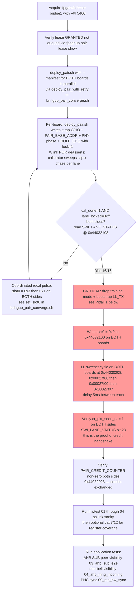
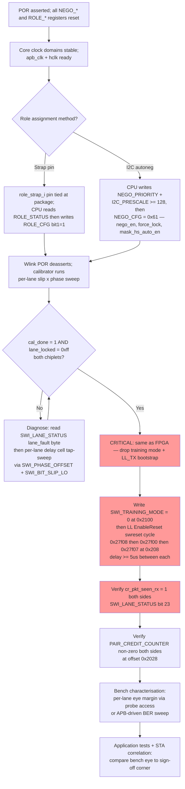
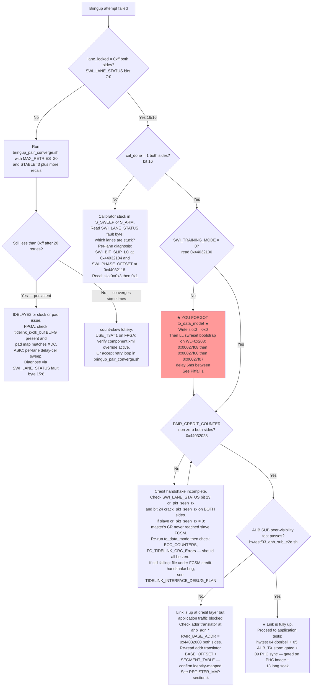

# TideLink Chiplet Interconnect — Bringup User Guide

**Audience:** HW engineer with bitstream/GDS in hand, boards or characterisation parts available, intending to bring the TideLink chiplet interconnect from cold POR to verified application traffic.

**Scope:** Both FPGA (PYNQ-Z2 pair) and ASIC target paths. Where the two diverge, sections call out the deltas.

**Status:** As of 2026-05-24, FPGA link-layer bringup (16/16 lanes) is reliable on the unified `main`. Application-layer transport across the link (AHB SUB peer-write, doorbell, PTP) is still failing on `b24-rx-decouple` because the credit handshake never opens — root cause class identified, see [Section 5, Pitfall 1](#pitfall-1-link-stuck-in-training-mode-2026-05-24).

**Cross-references:**
- Authoritative register definitions: [`docs/REGISTER_MAP.md`](REGISTER_MAP.md)
- Existing user-level reference: [`docs/USER_GUIDE.md`](USER_GUIDE.md)
- Full HW test catalogue: [`docs/HW_TEST_SUITE.md`](HW_TEST_SUITE.md), [`docs/HW_TEST_SUITE_DEV_LOG.md`](HW_TEST_SUITE_DEV_LOG.md)
- ASIC sign-off rules: [`docs/ASIC_TIMING_CONSTRAINTS.md`](ASIC_TIMING_CONSTRAINTS.md)
- Autoneg protocol (I2C role coordination): [`docs/AUTONEG_PROTOCOL.md`](AUTONEG_PROTOCOL.md)
- PHY abstraction (GPIO vs SerDes swap): [`docs/PHY_LAYER_ABSTRACTION.md`](PHY_LAYER_ABSTRACTION.md)
- Most recent interface debug session: [`docs/TIDELINK_INTERFACE_DEBUG_PLAN.md`](TIDELINK_INTERFACE_DEBUG_PLAN.md), [`docs/TIDELINK_PHASE0_OBS_20260524_2109.md`](TIDELINK_PHASE0_OBS_20260524_2109.md)

---

## Section 1 — Architecture overview

### 1.1 What TideLink is

`tidelink_top` is a top-level chiplet subsystem (see `src/rtl/tidelink_top.sv:1-35`) that wraps every component needed to move packets between two chiplets across a source-synchronous GPIO link:

- `tidelink_fifo_ahb` — credit-tracked RX FIFO with AHB data window
- `tidelink_fc_adapter` — bridges TX AHB aperture and the local returner to a dedicated 48-bit FC node (`data_id=0xa1`)
- Two `XHB500` instances — generic AHB↔AXI bridges for the regular AXI-bus traffic
- `tidelink_addr_translator` — runtime-configurable address remap for the AXI path
- `axi_chiplet_controller` (`deps/axi-chiplet-controller`) — Wlink (link layer, FC, CRC/ECC, PHY) + I2C sideband + autoneg FSM

### 1.2 The four AHB ports

Cited from `src/rtl/tidelink_top.sv:14-19`:

| Port | Role | Notes |
|------|------|-------|
| `ahb_sub_*` | AHB subordinate; regular AHB access to the remote side via XHB500 → AXI → Wlink. Address-translated. | **Safe** even with link down (HREADY returned locally). Used by `03_ahb_sub_e2e.sh` peer-visibility test. |
| `ahb_tx_*` | AHB subordinate; direct TideLink TX aperture into the local FC node (no address translation). | **WEDGE HAZARD.** If the link is not up, an AHB_TX write hangs the PS in kernel space and kills SSH; physical power-cycle required. Always gated by `tt_gate_ahb_tx()` in hwtest. |
| `ahb_fifo_*` | AHB subordinate; local RX FIFO read window (drain received packets). | Safe. |
| `ahb_mng_*` | AHB manager out of `tidelink_top`; incoming credit-return / doorbell / TideLink-FC writes from the remote side, routed through XHB500. | Safe — landing in local memory. |

### 1.3 The `data_id` space

TideLink rides on Wlink's FC node multiplex. Allocations cited from `pynq_host/scripts/wlink_probe.sh:14-19` and `docs/REGISTER_MAP.md §2.3`:

| `data_id` | Channel | Notes |
|-----------|---------|-------|
| `0x40-0x43` | Reserved control / sideband (Wlink credit-management range, includes `0x40` Credit-Release, `0x41` Credit-Release-Ack) | Internal to Wlink FCSM. |
| `0x80-0x84` | AXI AW/W/B/AR/R — through `XHB500` | Carries regular AXI bursts. |
| `0xa1` | TideLink — general 48-bit FC node | Dedicated direct path. The `data_id` you'll see for AHB_TX, doorbell, credit-release, and FIFO data. |
| `0xa2` | PTP — short-packet sideband for PHC sync | Used by `tidelink_ptp`; `data_id=0x50` short-packet variant observed by ILA. |
| `0xa3` | IRQ Controller — short-packet IRQ notifications | Reserved; not yet exercised on HW. |

### 1.4 Block dataflow (master CPU → ribbon → peer)

```
+----------------+      +-----------------+      +-----------------+      +-------------+
| Master CPU/PS  |      |   tidelink_top  |      |  Wlink + GPIO   |      |   Ribbon    |
|                |      |                 |      |   PHY (8 lanes) |      |  cable /    |
|                |      |  +-----------+  |      |  +-----------+  |      |  package    |
| AHB_TX wr ------>+-----> | fc_adapter|-------> | |  TX FCSM  |  |      |  channel    |
| 0x4400_0000    |      |  | sp/lp tx  |  |      | | + LL_TX   |  |      |             |
|                |      |  +-----------+  |      | +-----------+  |      |             |
| DOORBELL  ------>+-----> APB returner |       | pad_clk_tx --->|----->|             |
| 0x44032014     |      |  +-----------+  |      | pad_tx[7:0]--->|----->|             |
|                |      |                 |      |                 |      |             |
|                |      |  +-----------+  |      | +-----------+  |      |             |
| AHB_FIFO ------>+-----> |   FIFO    | <-------|+ RX demux  |  |      |             |
| (drain pkts)   |      |  | + creds   |  |      | + LL_RX   | <|------|             |
|                |      |  +-----------+  |      | +-----------+  |      |             |
| AHB_MNG <-------+------ | xhb500    | <-------- | cr_pkt    |<-|------|             |
| (incoming)     |      |  | mgr      |  |      | | crack_pkt | <|------|             |
|                |      |  +-----------+  |      | +-----------+  |      |             |
| APB cfg <------>+------ | regs +    |  |      | pad_clk_rx <---|------|             |
| 0x44030000     |      |  | autoneg   |  |      | pad_rx[7:0] <--|------|             |
| 0x44032000     |      |  | + i2c     |  |      |                |      |             |
+----------------+      +-----------------+      +-----------------+      +-------------+
                                                      (peer is mirror of the above)
```

### 1.5 ASIC vs FPGA — differences that matter at bringup time

| Topic | ASIC target (v1) | FPGA target (PYNQ-Z2) |
|-------|------------------|------------------------|
| Link rate | ~100 MHz pad clock | 25 MHz pad clock (40 ns UI) |
| PHY type | GPIO PHY (`WavD2DGpio`), source-synchronous | Same GPIO PHY |
| RX clock entry | Library I/O cell + dedicated low-skew clock spine — characterised. ASIC must enforce I/O-clock segregation from core CTS (see [`ASIC_TIMING_CONSTRAINTS.md` §5](ASIC_TIMING_CONSTRAINTS.md)). | `pad_clk_rx` enters Y7-MRCC (non-flip) or Y9-SRCC (flip) — clock-region asymmetry caused months of FPGA-specific debug. |
| Per-lane skew compensation | Per-lane programmable delay-cell macro (ASIC analogue of IDELAYE2), driven by calibrator (`ASIC_TIMING_CONSTRAINTS.md §4.3`). | `IDELAYE2` per `pad_rx[n]` — gated by `USE_IDELAY=1` parameter on FPGA wrapper. |
| Build-flag knobs (`tidelink_top.sv:65-74`) | All `USE_*` parameters default `1'b0`. | FPGA wrapper sets `USE_IDELAY=1`, `USE_CLKBUF=1`, `USE_T3A=1` via `component.xml`. **Do not delete these paths** — they are FPGA-essential ([memory `project_tidelink_v1_asic_target`](../README.md)). |
| Role selection | Strap pin (if available) or I2C autoneg ([`AUTONEG_PROTOCOL.md`](AUTONEG_PROTOCOL.md)) — autoneg is silicon-validated 2026-05-20. | Same. FPGA uses `axi_gpio_strap @ 0x44040000` written by `deploy_pair.sh`. |
| ROLE_CFG lock writes (`docs/REGISTER_MAP.md §1 Region 4`) | Same registers, same W1S semantics. | Same. |
| `to_data_mode()` post-lock training drop | **REQUIRED** on both targets. Identical APB sequence. | See [Pitfall 1](#pitfall-1-link-stuck-in-training-mode-2026-05-24). |
| Provenance check | sha256 of GDS / OASIS handoff; mask-set ID printed on first FC packet | `deploy_pair.sh --manifest`, ledger appended to `deployed.json` |
| Sign-off gates | STA + CDC + per-lane skew determinism ([`ASIC_TIMING_CONSTRAINTS.md §9 sign-off checklist`](ASIC_TIMING_CONSTRAINTS.md)) | `bringup_pair_converge.sh` 16/16 + `hwtest/run_all.sh` |

---

## Section 2 — Prerequisites checklist

### 2.1 FPGA bringup (PYNQ-Z2 pair on `bridge1`)

- [ ] **Boards powered and online.** z2_02 (master, die_a, IP `192.168.4.101`) and z2_03 (slave, die_b, IP `192.168.6.101`). Verify `mapstone-dev` can SSH them (`reference_pynq_boards.md`).
- [ ] **`mapstone-dev` access** with `dam1n19` (or equivalent) credentials. Boards are not directly routable from `srv03335`; use ProxyJump per [`reference_pynq_boards.md`](../../.claude/projects/-home-dam1n19-SoCLabs-tidelink/memory/reference_pynq_boards.md).
- [ ] **`fpgahub bridge1` lease GRANTED**, not queued. See [Pitfall 2](#pitfall-2-lease-must-be-granted-before-deploy). Command:
  ```bash
  ssh mapstone-dev /opt/fpgahub/bin/fpgahub pair lease acquire bridge1 \
       --user "$(whoami)" --ttl 5400
  ssh mapstone-dev /opt/fpgahub/bin/fpgahub pair lease show bridge1
  ```
- [ ] **Bitstream pair staged in `/tmp/tidelink_deploy/`** on mapstone-dev:
  - `tidelink.bin` + `tidelink.hwh` (die_a, non-flip)
  - `tidelink-flip.bin` + `tidelink-flip.hwh` (die_b, flip)
  - **Matching `*.manifest.json`** for each `.bin` (`pynq_host/scripts/make_bitstream_manifest.sh`). Without manifest, `deploy_pair.sh` hard-aborts on UNVERIFIED DEPLOY (`pynq_host/scripts/deploy_pair.sh:228`).
- [ ] **`sshpass` and Python3** on mapstone-dev — boards are accessed via `sshpass + ssh xilinx@<ip>` + `sudo python3 -c '...'` against `/dev/mem`.
- [ ] **JTAG access (optional, for ILA)** — FT2232H cables plugged at mapstone-dev, all four boards visible via `tcp::3121` hw_server (`reference_pynq_boards.md` Channel 2).
- [ ] **`.ltx` debug-core file staged** alongside the `.bin` if you intend ILA capture. See [`reference_phc_ila_capture.md`](../../.claude/projects/-home-dam1n19-SoCLabs-tidelink/memory/reference_phc_ila_capture.md) and `pynq_host/scripts/phc_ila_capture.{sh,tcl}`.

### 2.2 ASIC bringup

- [ ] **GDS / OASIS handoff sha256** matched against the tape-out manifest.
- [ ] **Target node confirmed** (TSMC65 for v1) — characterised I/O cell library, package model, channel model loaded into the STA flow (`ASIC_TIMING_CONSTRAINTS.md §6`).
- [ ] **Sign-off gates green** — see `docs/SIGN_OFF_STATUS.md` and the [`ASIC_TIMING_CONSTRAINTS.md §9 checklist`](ASIC_TIMING_CONSTRAINTS.md). Specifically:
  - STA at all PVT corners (TT/SS/FF) with the source-sync arcs analysed
  - CDC sign-off (Spyglass, `docs/SPYGLASS_CDC_SIGNOFF.md`)
  - Per-lane skew determinism metric per `docs/DETERMINISM_VALIDATION.md`
- [ ] **Characterisation lab bench** ready with:
  - Bench probe access to `pad_clk_rx` and `pad_rx[7:0]` (for eye margin)
  - I2C bus access on the chiplet pair (autoneg or manual role configuration)
  - APB access (via PS-equivalent, JTAG, or test bus)
- [ ] **Role-selection method decided** — strap pins, OTP fuse, or I2C autoneg ([`AUTONEG_PROTOCOL.md`](AUTONEG_PROTOCOL.md)). Autoneg is the recommended method for symmetric chiplets; silicon-validated as of 2026-05-20.
- [ ] **PHC reference clock available** if PHC sync is in scope; PHC IP is external to `tidelink_top` and has its own APB port.

---

## Section 3 — Bringup procedure with flowcharts

### 3.1 FPGA flowchart (PYNQ-Z2 pair, manual coordination)



#### 3.1.1 Step-by-step commands (FPGA)

**Step 1 — Lease.** From any host that can ssh to `mapstone-dev`:

```bash
ssh mapstone-dev "/opt/fpgahub/bin/fpgahub pair lease acquire bridge1 --user \$(whoami) --ttl 5400"
ssh mapstone-dev "/opt/fpgahub/bin/fpgahub pair lease show bridge1"  # MUST say granted to <you>
```

**Step 2 — Stage artefacts.** On `mapstone-dev`:

```bash
mkdir -p /tmp/tidelink_deploy
# Copy in tidelink.bin, tidelink.hwh, tidelink-flip.bin, tidelink-flip.hwh
# AND their .manifest.json siblings produced by make_bitstream_manifest.sh
```

**Step 3 — Deploy.** From `mapstone-dev`:

```bash
# Either: convergence-loop variant — retries up to MAX_RETRIES with parallel recal
bash pynq_host/scripts/bringup_pair_converge.sh

# Or: minimal pair deploy (single deploy, no closed-loop convergence)
bash pynq_host/scripts/deploy_pair.sh 192.168.4.101 z2_02 die_a /tmp/tidelink_deploy \
    --manifest /tmp/tidelink_deploy/tidelink.bin.manifest.json &
bash pynq_host/scripts/deploy_pair.sh 192.168.6.101 z2_03 die_b /tmp/tidelink_deploy \
    --manifest /tmp/tidelink_deploy/tidelink-flip.bin.manifest.json &
wait
```

`deploy_pair.sh` for each board (see `pynq_host/scripts/deploy_pair.sh:303-356`) writes:
- `0x44040000` (strap GPIO) = 0 master / 1 slave
- `0x44041000` (debug_unlock GPIO) = 1 — opens slave APB write path
- `0x44030000+0x00` (PHY ctrl) = `swi_phase_offset` (0 for master, 3<<17 for slave; see `deploy_pair.sh:115-117`)
- `0x44032000+0x00` (PAIR_BASE_ADDR) = `0x44032000` (peer's TideLink APB)
- `0x44032000+0x80` (ROLE_CFG) = `0x2` master / `0x3` slave (sets `role_lock` = bit[1])
- `0x44030000+0x208` (Wlink EnableReset) bootstrap: `0x00027f08` → `0x00027f00` → `0x00027f07`

After deploy, each calibrator runs autonomously inside `axi_chiplet_controller` and converges within ~80 µs to a few ms depending on count-skew. **At this point on the v1 b24 bitstream, link layer is up but training mode is still asserted** — proceed to Step 4.

**Step 4 — CRITICAL: release training, bootstrap data mode.** This is the step the modern `bringup_pair_converge.sh` MISSES. Replicate `to_data_mode()` from `pynq_host/scripts/sw_coord_autocal_region8.sh:65-85`:

```bash
# Run on BOTH boards in parallel
for IP in 192.168.4.101 192.168.6.101; do
  sshpass -p xilinx ssh xilinx@$IP "echo xilinx | sudo -S python3 -c '
import mmap,struct,os,time
fd=os.open(\"/dev/mem\",os.O_RDWR|os.O_SYNC); P=4096
def mm(a,sz=4096):
  b=a&~(P-1); o=a-b; pg=((sz+o+P-1)//P)*P
  return mmap.mmap(fd,pg,mmap.MAP_SHARED,mmap.PROT_READ|mmap.PROT_WRITE,offset=b),o
r,ro=mm(0x44032000,0x400)
struct.pack_into(\"<I\",r,ro+0x100,0)           # slot0 = 0 : drop training+recal
w,wo=mm(0x44030000,0x2000)
time.sleep(0.005)
struct.pack_into(\"<I\",w,wo+0x208,0x00027f08)  # LL swreset on
time.sleep(0.005)
struct.pack_into(\"<I\",w,wo+0x208,0x00027f00)  # LL swreset off
time.sleep(0.005)
struct.pack_into(\"<I\",w,wo+0x208,0x00027f07)  # swi+lltx+lltx_1 enabled
'" &
done
wait
```

Or simply run `pynq_host/scripts/sw_coord_autocal_region8.sh` end-to-end — it includes the recal AND the data-mode transition.

**Step 5 — Verify link health.** See [Section 4 table](#section-4--verification-table).

**Step 6 — Application tests.** With link up:

```bash
cd /home/dam1n19/SoCLabs/tidelink
MASTER_IP=192.168.4.101 SLAVE_IP=192.168.6.101 \
  pynq_host/scripts/hwtest/run_all.sh
```

### 3.2 FPGA flowchart (autonomous I2C autoneg)

Available on `feat/i2c-autonomous-lock-integ @ a657306` (autoneg silicon-validated 2026-05-20, mask phase still skipped on silicon as of that date — see [`project_tidelink_i2c_autonomy.md`](../../.claude/projects/-home-dam1n19-SoCLabs-tidelink/memory/project_tidelink_i2c_autonomy.md)).

```bash
# Pre-flight: bitstream must be on-ribbon I2C variant (i2c_sda_io=W9, i2c_scl_io=V7 or P15/P16 fallback)
bash pynq_host/scripts/bringup_autocal_i2c.sh --confirm-onribbon --pair
```

This script writes only `PAIR_BASE_ADDR` + `NEGO_CFG = 0x61` (`nego_en | force_lock | mask_hs_auto_en`) per board and polls `NEGO_STATUS` for lock. No SSH coordination, no manual recal. Order/concurrency don't matter — the I2C handshake coordinates the overlap in hardware.

**Important:** `role_locked = 1` is necessary but NOT sufficient for traffic. Per `bringup_autocal_i2c.sh:42-47` and [`docs/SHORTCOMINGS.md §14b`](SHORTCOMINGS.md), post-autoneg you still need the `to_data_mode()` step (or equivalent FCSM credit-exchange completion).

### 3.3 ASIC flowchart



#### 3.3.1 ASIC bringup notes (where the flow is less established)

- **Clock setup at 100 MHz.** The ASIC v1 target runs the GPIO pad clock at ~100 MHz (UI = 10 ns) per [memory `project_tidelink_v1_asic_target`](../../.claude/projects/-home-dam1n19-SoCLabs-tidelink/memory/project_tidelink_v1_asic_target.md). At sign-off, the calibrator window is `T_UI / 16 = 0.625 ns` per phase step — much tighter than the FPGA's 2.5 ns. Bench characterisation should confirm the static per-lane skew distribution lies inside this.
- **Reset sequence — undocumented in repo.** No project memory documents an end-to-end ASIC bringup procedure as executed against silicon. The flow above is derived by analogy from the FPGA procedure plus the [`ASIC_TIMING_CONSTRAINTS.md`](ASIC_TIMING_CONSTRAINTS.md) sign-off checklist. **First-silicon bringup will likely uncover gaps in this section.**
- **Role-assignment mechanism — system-integrator decision.** ASIC v1 RTL supports strap, software override, OTP, SRAM PUF, and I2C autoneg ([`AUTONEG_PROTOCOL.md §3.3`](AUTONEG_PROTOCOL.md)). Choice depends on whether the two chiplets are physically differentiated.
- **No FPGA-only workarounds.** `USE_CLKBUF`, `USE_IDELAY`, `USE_T3A` are all `1'b0` on the ASIC build (see `tidelink_top.sv:65-74`). Do NOT delete them from the codebase — they are wrapper-overridden on FPGA via `component.xml` ([memory `project_tidelink_v1_asic_target`](../../.claude/projects/-home-dam1n19-SoCLabs-tidelink/memory/project_tidelink_v1_asic_target.md)).
- **`to_data_mode()` requirement applies.** The training-mode drop and LL_TX swreset bootstrap is RTL-level behaviour, not FPGA-specific. ASIC bringup will need the same APB sequence. Lab firmware should encapsulate it as a single helper.

---

## Section 4 — Verification table

The order matches a top-down bringup. At each step, read the register, check the expected value, interpret a failure with the suggested escalation.

| # | Step | Register / observable | Expected value | What failure means | Test script |
|---|------|------------------------|----------------|--------------------|-------------|
| 1 | Bitstream loaded (FPGA only) | `/sys/class/fpga_manager/fpga0/state` (read by `deploy_pair.sh:287-289`) | `operating` | scp/load race or bad bitstream. `deploy_pair.sh` retries `MAX_LOAD_ATTEMPTS` times then hard-fails. | `deploy_pair.sh` itself |
| 2 | TideLink IP detectable | `TIDELINK_VERSION` (= `DOORBELL` register read returns version literal) at `0x44032014` | `0x?????` (non-zero, non-`0xFFFFFFFF`) | Wrong design loaded or APB path dead. Check provenance ledger `/tmp/tidelink_deploy/deployed.json`. | `bringup_autocal_i2c.sh:124-126` |
| 3 | Role committed | `ROLE_STATUS @ 0x44032084` | bit[0]=role, bit[1]=locked=1 | Strap GPIO or APB write failed. Check `debug_unlock GPIO @ 0x44041000 = 1` on the slave. | `hwtest/12_chiplet_phyalign.sh` |
| 4 | Calibrator converged | `SWI_LANE_STATUS @ 0x44032108` | `lane_locked[7:0] = 0xff`, `lane_fault[15:8] = 0x00`, `cal_done[16] = 1` | If `cal_done=0`: calibrator stuck in S_SWEEP/S_ARM — per-lane skew exceeds calibrator window. Check `lane_fault` byte for which lanes are stuck. If `lane_locked < 0xff` but `cal_done=1`: a calibrator latched at the eye edge. Run coordinated recal (slot0 `0x3 → 0x1`). | `hwtest/01_wlink_layer.sh` |
| 5 | Training mode dropped | `SWI_TRAINING_MODE @ 0x44032100` | `0x00000000` | If non-zero, the link is still emitting the training pattern and the queued initial CR packet has never drained. **This is the load-bearing step — see [Pitfall 1](#pitfall-1-link-stuck-in-training-mode-2026-05-24).** | n/a — direct read after `to_data_mode()` |
| 6 | LL_TX/RX/SWI enabled | `WL_EnableReset @ 0x44030208` | `0x00027f07` (`swi+lltx+lltx_1 = 1`, `swreset = 0`) | Wlink link layer not enabled. Re-run the swreset bootstrap. | `wlink_probe.sh` LinkCRC region dump |
| 7 | CR packet received by peer | `SWI_LANE_STATUS @ 0x44032108` bit[23] = `cr_pkt_seen_rx` | `1` on BOTH sides | If `0` on either side: that side's FCSM never received the master's initial Credit-Release. Credit window never opens. **Symptoms downstream**: PAIR_CREDIT_COUNTER stays at 0, doorbells don't cross, PHC sync fails, AHB_SUB peer-write returns 0. Cross-reference [`TIDELINK_PHASE0_OBS_20260524_2109.md §4.2`](TIDELINK_PHASE0_OBS_20260524_2109.md). | `hwtest/01_wlink_layer.sh §1b` |
| 8 | Credit handshake complete | `PAIR_CREDIT_COUNTER @ 0x44032028` | non-zero on BOTH sides | If zero: same root cause as step 7 — FCSM never opened. Even with PHY 100% clean and ECC=0/0. | `hwtest/04_ahb_mng_incoming.sh §4c` |
| 9 | Local FIFO healthy | `CURRENT_CREDITS @ 0x4403200C` | `0x00001000` (4096) at idle | Below 4096 with no TX: stuck packet or queue not draining. | `hwtest/06_ahb_fifo.sh` |
| 10 | No sticky errors | `TideLink STATUS @ 0x44032010` | `0x00000000` ideally; `bit[2]=fifo_underrun` may set during boot transients | Sticky errors after stable boot indicate a real FIFO miss. Use `CTRL.FLUSH` to clear. | `hwtest/02_tidelink_top_regs.sh §2g` |
| 11 | ECC counters quiet | `ECC_COUNTERS @ 0x44032114` | `0x00000000` (corrupted lo / corrected hi both 0) | Non-zero `corrupted` count = PHY/byte-align fail. Non-zero `corrected` = link is recovering single-bit errors (acceptable at low rate). | `hwtest/01_wlink_layer.sh §1d` |
| 12 | FC TideLink CRC clean | `FC_TIDELINK_CRC_Errors @ 0x44031720` | `0` both sides | FC-layer CRC corruption = physical-layer problem. Escalate to per-lane skew / IDELAY tap / pad map. | New register — was unread until [Phase 0 obs 2026-05-24](TIDELINK_PHASE0_OBS_20260524_2109.md) |
| 13 | Wlink link healthy | `WL_LinkStatus @ 0x44030234` | `bit[4]=rx_data_valid=1`, `bit[2]=in_error_state=0` | `in_error_state=1` is the Wlink-level "give up". Power-cycle, recheck XDC / pad map. | `wlink_probe.sh` LinkCRC region |
| 14 | Peer-visible AHB write | `hwtest/03_ahb_sub_e2e.sh §3d` — master writes `0xDEADBEEF` to `0x44010000`, slave reads same offset | slave reads `0xDEADBEEF` | If slave reads `0x00000000`: credit window did not open. Same root cause as step 7. **Do not try AHB_TX (0x4400_0000)** as a fallback — wedge hazard. | `hwtest/03_ahb_sub_e2e.sh` |
| 15 | Doorbell crosses | Master writes 8x `DOORBELL @ 0x44032014`, slave reads `DOORBELL_RESPONSE_ACC @ 0x44032024` | slave reads `~8` (read clears) | Same root cause as step 14. | `hwtest/04_ahb_mng_incoming.sh §4b` |
| 16 | PTP HW sync (gated on PHC image) | `HW_SYNC_STATUS @ 0x44032048` on slave | non-zero `seq_num` advancing | Slave stuck at `0x0` while master advances = sync packets not crossing. Currently a SEPARATE bug (`docs/PHC_PHASE1_HANDOFF.md`) but post-Phase-0 it collapses to the credit-handshake root cause. | `hwtest/09_ptp_hw_sync.sh` |

---

## Section 5 — Known bringup pitfalls

These are the failure modes the project has burnt time on. They are the most valuable part of this guide — every one is either documented from real session debug logs or codified in script comments.

### Pitfall 1 — Asymmetric slave LL_RX byte-alignment loss at training→FC transition (REVISED 2026-05-25)

**Earlier diagnosis was incomplete.** The original "training mode held" finding was a surface symptom of a deeper RTL issue. Final diagnosis below.

**Symptom.** After `bringup_pair_converge.sh`: `lane_locked=0xff`, `cal_done=1`, `fault=0x00`, `ECC=0/0`, `FC_TIDELINK_CRC=0`, `LinkStatus.rx_data_valid=1` — every PHY-layer metric is clean. But:
- `PAIR_CREDIT_COUNTER @ 0x44032028` reads `0x00000000` on BOTH sides
- `DOORBELL_RESPONSE_ACC @ 0x44032024` does not tick when peer writes `DOORBELL`
- PHC `HW_SYNC_STATUS` stuck at `0x0` on slave
- HW ILA capture (2026-05-25): **slave `llrx/state=iSTATE` STUCK forever**; ECC sees bits but no valid SOP detected; **master `llrx/valid=1` constantly** (decodes slave's traffic fine)
- Bug is ASYMMETRIC — only slave's link layer is broken; master is fine

**Root cause.** The per-lane PHY mux at [`deps/axi-chiplet-controller/logical/wlink/WavD2DGpioTx.v:43-45`](../deps/axi-chiplet-controller/logical/wlink/WavD2DGpioTx.v) flips MID-WORD when `effective_training_mode` falls 1→0:
```verilog
wire [15:0] _link_data_eff = io_training_mode
                            ? {io_training_pattern, io_training_pattern}
                            : io_link_data;
```
The hybrid 16-bit transition word (first half = training pattern, second half = FC data) is NOT a valid ECC long-packet header. Slave's LL_RX SOP-search FSM misses it. Subsequent valid cr_pkts ALSO can't be decoded because byte boundary has shifted from POR-established alignment.

**CRITICAL discovery: POR-active state.** At fresh POR (BEFORE any bringup script runs):
- Slave: `fcsm=4 (LINK_IDLE)`, `is_short_pkt=1`, `llrx_valid=1` — RX active
- Master: `fcsm=2 (SEND_CREDITS2)`, `cr_seen=1`

The link is half-handshaked at POR with byte alignment intact. `bringup_pair_converge.sh`'s slot0=0x3 recal cycle ACTIVELY BREAKS this by re-arming `WavD2DGpioRx.count` phase counter.

**Earlier hypotheses (all falsified)**:
- swi_enable=0 transient in `to_data_mode()` swreset — FALSIFIED (HW test of FIX script changed nothing)
- WlinkTxPstateCtrl circular dep deadlock — proven at unit but never entered in this scenario
- FCSM TX router stops post-drop — disproven (instrumented sim shows 214 tx_advance pulses post-drop)
- sp2wl dataIdMatch=0 as second bug — correct by design (sp2wl is PTP-only filter; CR/CRACK route through FCSM-internal decoder)

**Fix candidates** (under test 2026-05-25):

1. **(SW only, simplest)** Skip `bringup_pair_converge.sh` entirely. If POR-alignment is sufficient, no RTL change is needed.
2. **(RTL defensive)** Word-aligned mux transition. Local override at [`src/rtl/local_overrides/WavD2DGpio.v`](../src/rtl/local_overrides/WavD2DGpio.v) (commit `5477e60` on `feat/td-interface-debug`). A 4-bit mirror counter `mux_align_count_r` tracks `WavD2DGpioTx.count`; the TX-side training_mode signal samples only at `count==4'hf` (word boundary). The mux only flips at clean word boundaries, producing valid ECC headers across the transition.

Cross-ref: [docs/TIDELINK_PHASE0_OBS_20260524_2109.md §11](TIDELINK_PHASE0_OBS_20260524_2109.md) for the full diagnostic chain.

**Earlier proposed fix that does NOT work**: the `sw_coord_autocal_region8_FIX.sh` script (which changed the swreset cycle to `0x27f09→0x27f01→0x27f07` to keep swi_enable=1) was tested on HW and made no difference. The swi_enable transient was a red herring. The SW workaround is NOT the right path — the bug is in the WAV TX RTL.

### Pitfall 2 — Lease must be GRANTED before deploy

**Symptom.** `fpgahub pair lease show bridge1` reports the lease is "free" or "queued" but the operator assumes they hold it. The first deploy succeeds; subsequent ones quietly fail with a permission-denied that gets eaten by `>/dev/null`.

**Root cause.** `fpgahub pair lease acquire` may return immediately with status `queued`, meaning the request is in queue but not yet active. Heartbeat will then 403. Verified in [memory `feedback_lease_grant_before_deploy`](../../.claude/projects/-home-dam1n19-SoCLabs-tidelink/memory/feedback_lease_grant_before_deploy.md).

**Fix.** Always verify state is "granted to <you>" before deploy:
```bash
ssh mapstone-dev "/opt/fpgahub/bin/fpgahub pair lease show bridge1"
# expected output includes: granted to <user>, expires at <ts>
```
On orphan cleanup: `pkill -9` the WHOLE deploy tree, not just the parent — `setsid`-detached children survive parent kill.

### Pitfall 3 — Do not write `0x4400_0000` (AHB_TX) until link is verified up

**Symptom.** Operator's `python3 -c '... mmap ... write 0x4400_0000'` hangs in kernel space. SSH dies. Board needs a physical power-cycle; UART reboot may not recover it.

**Root cause.** AHB_TX writes go through the FC adapter; if the link is down, the FC adapter never asserts HREADY back. The AXI-Lite-to-AHB bridge in the BD stalls, SmartConnect blocks, the PS mmap write hangs in kernel mode. Documented bench evidence 2026-04-27 ([`pynq_host/scripts/wlink_probe.sh:37-50`](../pynq_host/scripts/wlink_probe.sh)).

**Fix.** Gate every AHB_TX write behind a verified link check. `hwtest/lib/lib_hwtest.sh` provides `tt_gate_ahb_tx()` — refuses to proceed unless 16/16 + `cal_done` on both sides. Every AHB_TX write is also wrapped in `timeout AHB_TX_TIMEOUT_S` so a wedge cannot block the host. See `hwtest/05_ahb_tx_storm.sh`.

### Pitfall 4 — ILA dbg_hub `C_CLK_INPUT_FREQ_HZ` must match actual `ila_clk`

**Symptom.** `phc_ila_capture.tcl` retrieves correct ARM, TRIG, STATUS over JTAG but the captured waveform is garbage (all-zero or scrambled mid-frame).

**Root cause.** Vivado 2025.2 dbg_hub IP is read-only on `MAX_DATA_DEPTH` and `CAPTURE_MODE` properties; if `C_CLK_INPUT_FREQ_HZ` is left at the default (300 MHz) but `ila_clk` is actually 25 MHz, dbg_hub mis-times the capture and corrupts the readback. See [memory `reference_insert_debug_core`](../../.claude/projects/-home-dam1n19-SoCLabs-tidelink/memory/reference_insert_debug_core.md).

**Fix.** Agent K's `C_CLK_INPUT_FREQ_HZ` auto-derive patch is already in `fpga/insert_debug_core.tcl`. Verify it survived your branch rebases.

### Pitfall 5 — Bitstream provenance — use `--manifest` with `deploy_pair.sh`

**Symptom.** Operator builds bitstream A; bench team deploys, gets weird results. Hours of debug. Eventually discover `/tmp/tidelink_deploy/tidelink.bin` is bitstream B from a prior test — sha mismatches.

**Root cause.** Bug #32, first hit 2026-05-06 (`docs/LINK_DECAY_BISECT.md`), bit again 2026-05-23 — the same volatile staging dir was reused by two different test cycles; the WARNING-only verify message was ignored four times in a row.

**Fix.** `deploy_pair.sh:228` now hard-aborts (exit 5) on UNVERIFIED DEPLOY. To deploy without manifest you must pass `--no-verify` explicitly. Bench convention: every build emits `bitstream.bin.manifest.json` via `pynq_host/scripts/make_bitstream_manifest.sh`. `bringup_pair_converge.sh:191-200` enforces this automatically.

### Pitfall 6 — WavD2DGpioRx count phase is random-mod-16 per POR

**Symptom.** Byte-identical bitstream redeployed N times produces wildly different lane-lock counts: 0/16, 3/16, 7/16, 16/16 — uncorrelated across deploys.

**Root cause.** Each `WavD2DGpioRx` instance has a free-running `count` counter that starts incrementing the moment `role_lock` rises. Two boards have independent `role_lock` rising edges (SSH-launch skew, milliseconds) — `count` is mod-16 at the pad clock rate (320 ns window on FPGA). Calibrator's `swi_phase_offset` × `swi_bit_slip` window can compensate one direction per deploy but not always both. See `bringup_pair_converge.sh:7-27`.

**Fix.** Three layers:
1. RTL `USE_T3A=1` adds a per-lane comma-hunt in `WavD2DGpioRx.v` that slips `count` once per POR to align to the training-byte boundary. On `feat/td-combined`.
2. Script-level: `bringup_pair_converge.sh` does parallel deploys (lockstep `role_lock` ≈ SSH RTT not seconds) AND closed-loop recal — retries until BOTH `cal_done=1` and `lane_locked=0xff`.
3. Bench expectation: even with the above, expect mild symmetric per-deploy variation. The link converges but you may need 1-3 recal pulses.

For ASIC: the deterministic equivalent is the per-lane delay cell pre-characterised at sign-off, plus matched routing keeping `count` skew bounded by construction (`ASIC_TIMING_CONSTRAINTS.md §4`).

---

## Section 6 — Troubleshooting decision tree



---

## Section 7 — Quick reference cheatsheet

```bash
# ============================================================================
# TideLink FPGA bringup — minimum command set
# ============================================================================

# --- Lease ---
ssh mapstone-dev "/opt/fpgahub/bin/fpgahub pair lease acquire bridge1 \
    --user \$(whoami) --ttl 5400"
ssh mapstone-dev "/opt/fpgahub/bin/fpgahub pair lease show bridge1"
# Verify the show output says "granted to <you>", NOT "queued"

# --- Stage bitstream (mapstone-dev) ---
mkdir -p /tmp/tidelink_deploy
# copy tidelink.bin/.hwh + tidelink-flip.bin/.hwh + *.manifest.json

# --- Deploy with closed-loop convergence ---
bash pynq_host/scripts/bringup_pair_converge.sh
# (this gets lanes locked but DOES NOT call to_data_mode — next step)

# --- CRITICAL: release training mode + LL_TX bootstrap on BOTH sides ---
# Either run the all-in-one script:
bash pynq_host/scripts/sw_coord_autocal_region8.sh
# Or run only the data-mode transition portion (4-line sequence):
for IP in 192.168.4.101 192.168.6.101; do
  sshpass -p xilinx ssh xilinx@$IP "echo xilinx | sudo -S python3 -c '
import mmap,struct,os,time
fd=os.open(\"/dev/mem\",os.O_RDWR|os.O_SYNC); P=4096
def mm(a,sz=4096):
  b=a&~(P-1); o=a-b
  return mmap.mmap(fd,((sz+o+P-1)//P)*P,mmap.MAP_SHARED,mmap.PROT_READ|mmap.PROT_WRITE,offset=b),o
r,ro=mm(0x44032000,0x400); struct.pack_into(\"<I\",r,ro+0x100,0)
w,wo=mm(0x44030000,0x2000)
for v in (0x00027f08, 0x00027f00, 0x00027f07):
  time.sleep(0.005); struct.pack_into(\"<I\",w,wo+0x208,v)
'" &
done
wait

# --- Verify link health ---
bash pynq_host/scripts/wlink_probe.sh 192.168.4.101 z2_02
bash pynq_host/scripts/wlink_probe.sh 192.168.6.101 z2_03
# Look for: SWI_LANE_STATUS = 0x_8?00ff (lane_locked=0xff cal_done=1)
# AND bit[23]=1 on both (cr_pkt_seen_rx — credit handshake complete)
# AND PAIR_CREDIT_COUNTER non-zero on both

# --- Hwtest sanity sweep (link sanity, no AHB_TX) ---
MASTER_IP=192.168.4.101 SLAVE_IP=192.168.6.101 \
  pynq_host/scripts/hwtest/run_all.sh

# --- Release lease (always, even on failure) ---
ssh mapstone-dev "/opt/fpgahub/bin/fpgahub pair lease release bridge1"
# Also kill any orphan deploy trees:
ssh mapstone-dev "pkill -9 -f deploy_pair.sh; pkill -9 -f sshpass"

# ============================================================================
# Key registers, all at base 0x44030000 (Wlink) / 0x44032000 (TideLink)
# ============================================================================
# 0x44030208  Wlink EnableReset    bootstrap: 0x27f08 -> 0x27f00 -> 0x27f07
# 0x44030234  Wlink LinkStatus     bit[4]=rx_data_valid bit[2]=in_error_state
# 0x44031720  FC TideLink CRC Errs   expect 0
# 0x44032010  TideLink STATUS       fifo_overrun/underrun/master_error sticky
# 0x44032014  DOORBELL              write any value to ring peer
# 0x44032024  DOORBELL_RESPONSE_ACC clear-on-read; ticks per remote doorbell
# 0x44032028  PAIR_CREDIT_COUNTER   non-zero = credit handshake complete
# 0x44032048  HW_SYNC_STATUS        seq_num advancing under PHC sync
# 0x44032100  SWI_TRAINING_MODE     bit[0] = 1 during training; MUST be 0 for data
# 0x44032108  SWI_LANE_STATUS       0xXX00FF = 0xff locked, fault 0, cal_done=1
#                                   bit[23]=cr_pkt_seen_rx (must be 1)
#                                   bit[24]=crack_pkt_seen_rx
# 0x44032114  ECC_COUNTERS          ecc_corrupted[15:0] + ecc_corrected[31:16]
# 0x44032118  SWI_PHASE_OFFSET      8 lanes x 4-bit per-lane phase
# 0x4403211C  PHY_ALIGN_ID          must read 0x50410100
```

---

## Section 8 — Where to go next

### 8.1 After link bringup works

| Goal | Resource |
|------|----------|
| PHC time sync between master and slave | `pynq_host/scripts/bringup_ptp_sync.sh`, then `bringup_ptp_track_freq.sh`, `bringup_ptp_track_offset.sh`, `bringup_ptp_soak.sh`. See [`docs/PTP_PROTOCOL.md`](PTP_PROTOCOL.md), [`docs/PTP_HW_TEST_PLAN.md`](PTP_HW_TEST_PLAN.md). |
| Performance counters (perf-tx, perf-rx, debug) | `hwtest/11_perf_counters.sh` — snapshot 24 slots, drive light traffic, snapshot again, report which slots advanced. |
| ILA capture for credit-path debug | `pynq_host/scripts/phc_ila_capture.{sh,tcl}` + the `.ltx` staged on mapstone-dev. See [`reference_phc_ila_capture.md`](../../.claude/projects/-home-dam1n19-SoCLabs-tidelink/memory/reference_phc_ila_capture.md). |
| Multi-hour soak | `hwtest/13_long_soak.sh SOAK_SECS=28800` for 8h, or `bringup_ptp_soak.sh`. Acceptance: 0 drops, 0 sticky events. |
| Reliability across re-deploys | `hwtest/01_wlink_layer.sh RUN_RELIABILITY=1` — opt-in mini-sweep. |
| Determinism characterisation | `pynq_host/scripts/determinism_metric.sh` — inter-build per-lane skew variance, per [`docs/DETERMINISM_VALIDATION.md`](DETERMINISM_VALIDATION.md). |

### 8.2 For ASIC path

| Goal | Resource |
|------|----------|
| STA sign-off | [`docs/ASIC_TIMING_CONSTRAINTS.md §9 checklist`](ASIC_TIMING_CONSTRAINTS.md). Source-sync arcs must be analysed at every PVT corner; per-lane skew bounded by `set_max_delay -datapath_only` + `set_data_check`. |
| CDC sign-off | [`docs/CDC_AUDIT_REPORT.md`](CDC_AUDIT_REPORT.md), [`docs/SPYGLASS_CDC_SIGNOFF.md`](SPYGLASS_CDC_SIGNOFF.md). Recovered-RX → core CDC must use the established `tidelink_phc_cdc.sv` SYNC_STAGES pattern. |
| Characterisation lab | Per-lane eye margin, BER curve, voltage/temperature sweep, comparison to STA sign-off corner. Bench setup not yet documented in repo — first-silicon will need new docs. |
| Bring-up bench docs | Not yet written. After v1 first-silicon, document the actual lab procedure (POR sequence, bench probe points, oscilloscope captures) in a new `docs/ASIC_BRINGUP_BENCH.md`. |

### 8.3 Cross-reference index

- Active debug session: [`docs/TIDELINK_INTERFACE_DEBUG_PLAN.md`](TIDELINK_INTERFACE_DEBUG_PLAN.md), [`docs/TIDELINK_PHASE0_OBS_20260524_2109.md`](TIDELINK_PHASE0_OBS_20260524_2109.md)
- Sign-off status snapshot: [`docs/SIGN_OFF_STATUS.md`](SIGN_OFF_STATUS.md)
- Known shortcomings / open work: [`docs/SHORTCOMINGS.md`](SHORTCOMINGS.md), [`docs/OUTSTANDING_WORK_REPORT.md`](OUTSTANDING_WORK_REPORT.md)
- Bug tracker: [`docs/BUG_TRACKER.md`](BUG_TRACKER.md)
- Repo simplification (deletion candidates): [`docs/REPO_SIMPLIFICATION_ASSESSMENT.md`](REPO_SIMPLIFICATION_ASSESSMENT.md)

---

**End of guide. Keep this in sync with `docs/HW_TEST_SUITE.md` as new test categories are added, and append to Section 5 (Pitfalls) any time a new bringup failure mode is debugged on bench.**
